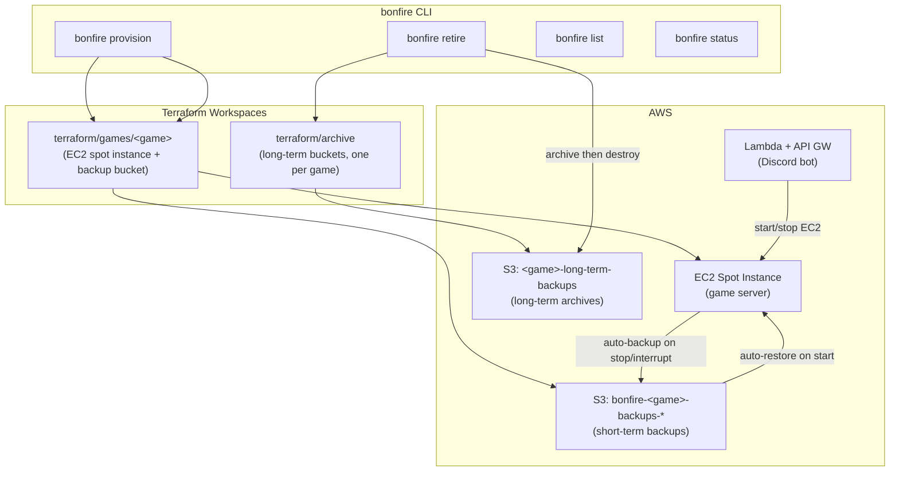

# Bonfire - Game Server on AWS

A CLI and Terraform toolkit for deploying and managing dedicated game servers on AWS using EC2 Spot Instances. Supports Valheim, Satisfactory, and Factorio, with an extensible architecture for adding more games. Includes a Discord bot for in-channel server control and automatic S3-backed saves at two tiers.

## Architecture



## Prerequisites

- AWS CLI configured with appropriate credentials
- Terraform installed
- Go 1.21+ (for the CLI)
- An S3 bucket for Terraform state

## Supported Games

| Game | Docker Image | Notes |
|------|-------------|-------|
| Valheim | `lloesche/valheim-server` | Password set via tfvars |
| Satisfactory | `wolveix/satisfactory-server` | |
| Factorio | `factoriotools/factorio` | Password patched by init service |

## Getting Started

### Using the CLI (recommended)

```bash
cd cli
make install   # installs bonfire binary via go install
```

The binary installs to `$GOPATH/bin` (usually `~/go/bin`). Ensure that directory is on your `$PATH`.

Provision a server:

```bash
bonfire provision valheim
```

To restore a long-term archive on provision:

```bash
bonfire provision valheim --restore
```

### Using Terraform directly

1. Create an S3 bucket for Terraform state:

   ```bash
   aws s3 mb s3://bonfire-tf-state --region eu-north-1
   ```

2. Navigate to the game directory:

   ```bash
   cd terraform/games/valheim
   ```

3. Create a `terraform.tfvars` file:

   ```bash
   cp terraform.tfvars.example terraform.tfvars
   ```

   Set at minimum:
   - `world_name`: Name of your game world
   - `server_pass`: Password for accessing your server

4. Initialize and apply:

   ```bash
   terraform init
   terraform apply
   ```

## CLI Reference

### `bonfire provision <game>`

Provisions a game server by running `terraform init` and `terraform apply` in `terraform/games/<game>/`.

```bash
bonfire provision valheim
bonfire provision valheim --restore   # restore a save from the long-term bucket
```

### `bonfire retire <game>`

End-of-season teardown: archives all saves to the long-term bucket, then runs `terraform destroy`. The long-term backup bucket is preserved.

```bash
bonfire retire valheim
```

### `bonfire list`

Lists all games that have a Terraform workspace, with EC2 instance state and public IP.

```bash
bonfire list
# GAME                 STATE            IP
# ----                 -----            --
# valheim              running          13.49.x.x
# satisfactory         stopped          -
```

### `bonfire status <game>`

Shows the current state of a game server: EC2 instance ID, instance state, public IP, last backup object, and long-term archive count.

```bash
bonfire status valheim
# Status: valheim
# ----------------------------------------
#   Instance ID:    i-0abc123def456789
#   Instance State: running
#   Public IP:      13.49.x.x
#   Last Backup:    s3://bonfire-valheim-backups-eu-north-1/worlds/Myworld.db
#   Long-term Archives: 3 snapshots, latest 2024-11-01T12:00:00Z
```

### Environment Variables

| Variable | Purpose | Default |
|---|---|---|
| `BONFIRE_REPO_ROOT` | Path to the repo root (where `terraform/` lives). Set if the binary can't locate the repo automatically. | Auto-detected by walking up from the binary location |
| `AWS_PROFILE` | AWS credentials profile to use | `bonfire-deploy` |
| `AWS_REGION` | AWS region for all operations | `eu-north-1` |
| `AWS_DEFAULT_REGION` | Fallback region if `AWS_REGION` is unset | `eu-north-1` |

### Required IAM Permissions

Commands that call Terraform (`provision`, `retire`) need the bonfire deploy role — see `terraform/archive/` for IAM role setup.

Commands that talk to AWS directly (`list`, `status`) need a narrower set:

```json
{
  "Version": "2012-10-17",
  "Statement": [
    {
      "Effect": "Allow",
      "Action": [
        "ec2:DescribeInstances"
      ],
      "Resource": "*"
    },
    {
      "Effect": "Allow",
      "Action": [
        "s3:ListBucket",
        "s3:GetObject"
      ],
      "Resource": [
        "arn:aws:s3:::bonfire-*-backups-*",
        "arn:aws:s3:::bonfire-*-backups-*/*",
        "arn:aws:s3:::*-long-term-backups",
        "arn:aws:s3:::*-long-term-backups/*"
      ]
    }
  ]
}
```

## Discord Bot

A serverless Discord bot lets your play group control the game server from Discord. Implemented with AWS Lambda and API Gateway.

### Commands

```
/<game> status   — check if the server is running or stopped
/<game> start    — start the server (authorized users only)
/<game> stop     — stop the server (authorized users only)
/<game> help     — show available commands
```

For example: `/valheim start`, `/satisfactory status`

See the [Discord Bot README](discord_bot/README.md) for setup and deployment instructions.

## Data & Backups

Bonfire uses a two-tier backup model so save data survives both spot interruptions and end-of-season teardowns.

### Short-term backups

Each game server writes save files to a dedicated S3 bucket (`bonfire-<game>-backups-<region>`) whenever the instance stops — whether from a spot interruption, a Discord `/stop`, or a manual `aws ec2 stop-instances`. When the instance starts again, the saves are automatically restored from that bucket. No manual intervention required.

### Long-term archives

Long-term buckets (`<game>-long-term-backups`) are managed by the `terraform/archive/` workspace, separate from the per-game stacks. They survive `terraform destroy` on a game server.

`bonfire retire` archives all saves to the long-term bucket before tearing down the server. Saved snapshots are stamped with a UTC timestamp prefix. To restore a long-term archive on your next provision:

```bash
bonfire provision valheim --restore
```

This lists available snapshots and copies the selected one into the game server after provisioning.

Versioning is enabled on long-term buckets with a 90-day noncurrent version retention policy.

## Adding a New Game

1. **Copy an existing game directory**:
   ```bash
   cp -r terraform/games/valheim terraform/games/newgame
   ```

2. **Update `terraform/games/newgame/main.tf`**:
   - Set `local.game` with the new game's Docker image, ports, and environment variables.

3. **Update `terraform/games/newgame/variables.tf`**:
   - Adjust variable names and defaults.

4. **Update `terraform/games/newgame/backend.tf`**:
   - Change the state key to `bonfire/newgame/terraform.tfstate`.

5. **If your game needs pre-start setup** (e.g. generating a config or patching a password), add an `init_service` block to the game object in `main.tf`. See `terraform/games/factorio/main.tf` for an example.

6. **Add the game to the long-term archive bucket list** — add its name to `var.games` in `terraform/archive/variables.tf`:
   ```hcl
   variable "games" {
     default = ["valheim", "satisfactory", "newgame"]
   }
   ```

7. **Deploy**:
   ```bash
   bonfire provision newgame
   ```

## Shell Access

SSH port 22 is closed by default. Use AWS Systems Manager Session Manager for shell access — no open ports or key files required.

```bash
# Install the Session Manager plugin (macOS)
brew install --cask session-manager-plugin

# Start a session
aws ssm start-session --target <instance-id>
```

**Emergency SSH (break-glass only):** If SSM is unavailable, pass your CIDR at apply time:

```bash
terraform apply --var 'allowed_ssh_cidr_blocks=["x.x.x.x/32"]'
```

A private key file (default: `valheim-key-ec2.pem`) is created in your current directory. Remove the CIDR after the emergency by re-applying without the variable.

## Clean Up

```bash
bonfire retire <game>
```

This archives saves to the long-term bucket and destroys the game server infrastructure. The long-term backup bucket is preserved.

To remove all resources including long-term buckets:

```bash
cd terraform/archive
terraform destroy
```
